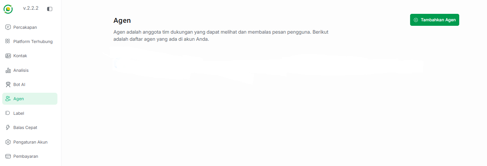
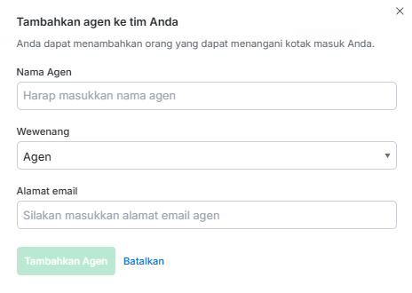

# 👥 Manajemen Agen

Halaman **Agen** digunakan untuk mengelola anggota tim dukungan (staf) Anda yang bertugas untuk berinteraksi dengan pelanggan. Agen adalah anggota tim dukungan yang dapat melihat dan membalas pesan pengguna. Di bawah ini adalah daftar agen yang ada di akun Anda.

---

## ➕ Cara Menambahkan Agen Baru

Untuk menambahkan anggota tim baru ke dalam dasbor Jangkau AI, ikuti langkah-langkah berikut:

1. Masuk ke menu **Agen** di panel sebelah kiri dasbor.
2. Klik tombol hijau **+ Tambahkan Agen** yang terletak di sudut kanan atas layar.
3. Sebuah jendela formulir (*pop-up*) akan muncul untuk melengkapi data agen baru.  

Silakan isi kolom formulir yang tersedia sebagai berikut:

*   **Nama Agen:** Masukkan nama lengkap dari anggota tim Anda.
*   **Wewenang:** Pilih tingkat hak akses yang akan diberikan kepada agen tersebut (Detail wewenang dapat dilihat pada bagian di bawah).
*   **Alamat email:** Masukkan alamat email aktif milik agen tersebut untuk keperluan login dan koordinasi sistem.

Setelah semua data terisi dengan benar, klik tombol hijau **Tambahkan Agen**.

---

## 🔐 Tingkatan Wewenang (Hak Akses)

Saat mendaftarkan agen baru, Anda dapat menentukan batasan akses kerja mereka melalui menu *dropdown* **Wewenang**. Jangkau.ai menyediakan 2 jenis wewenang dengan fungsi penanganan yang berbeda:

"1. Administrator"

*   **Hak Akses:** Hanya bisa membalas chat.
*   **Fungsi:** Ditujukan untuk staf atau tim operasional *Customer Service* (CS) murni yang fokus menangani alur masuk-keluar pesan dari pelanggan tanpa bisa mengubah sistem internal bot.

"2. Agen"

*   **Hak Akses:** Bisa mengedit bot.
*   **Fungsi:** Ditujukan untuk tim teknis atau manajer operasional yang memiliki wewenang penuh untuk mengubah, memperbarui, dan melakukan konfigurasi pada pengaturan Bot AI Anda.

---

## 💾 Menghubungkan Agen ke Kotak Masuk
Setelah agen berhasil dibuat, jangan lupa untuk masuk ke menu **Platform Terhubung** untuk menugaskan agen ini ke dalam saluran komunikasi (Website, WhatsApp, atau Telegram) yang sesuai agar mereka bisa mulai menerima dan merespons pesan pelanggan.