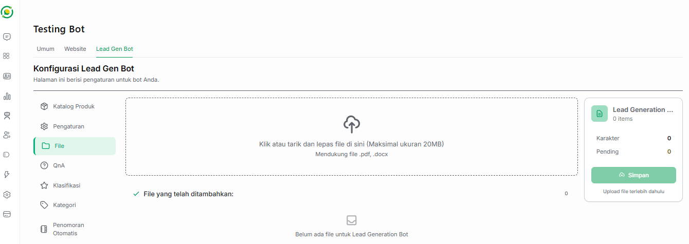

# 📂 File Basis Pengetahuan

Fitur **File** pada Bot Lead Generation memungkinkan Anda untuk memberikan dokumen referensi mendalam kepada AI. Dengan mengunggah dokumen resmi perusahaan, Bot AI akan memiliki pemahaman kontekstual yang kuat mengenai latar belakang dan detail operasional bisnis Anda saat mengobrol dengan pelanggan.

---

## 📄 Jenis Dokumen yang Direkomendasikan

Anda dapat mengunggah berbagai dokumen tertulis yang berkaitan langsung dengan bisnis Anda agar bot dapat menjawab pertanyaan yang lebih kompleks, seperti:

*   **Profil Perusahaan (Company Profile):** Berisi sejarah, visi, misi, dan nilai-nilai perusahaan.
*   **Latar Belakang Bisnis:** Informasi mengenai rekam jejak atau industri yang Anda geluti.
*   **Katalog Layanan/Produk:** Penjelasan detail mengenai fitur, manfaat, dan spesifikasi dari produk atau jasa yang Anda tawarkan.
*   **Dokumen Kebijakan:** Aturan garansi, syarat & ketentuan, atau prosedur operasional standar (SOP) pelayanan pelanggan.

---

## ⚙️ Ketentuan & Format File

Agar file dapat diproses dengan sempurna oleh sistem AI Jangkau.ai, pastikan dokumen Anda memenuhi kriteria berikut:

*   **Ukuran Maksimal:** File yang diunggah tidak boleh melebihi **20 MB** per file.
*   **Format yang Didukung:** Sistem saat ini menerima format dokumen berbentuk **`.pdf`** dan **`.docx`**.

---

## 📤 Cara Mengunggah Dokumen

1. Masuk ke menu **Bot AI** > **Lead Gen Bot** > klik tab **File** di sisi kiri.
2. Pada area kotak putus-putus, Anda bisa langsung **menyeret dan melepas (*drag & drop*)** file dari komputer Anda, atau **klik area tersebut** untuk memilih file secara manual dari penyimpanan lokal.
3. Setelah file terpilih, sistem di panel sebelah kanan akan menampilkan status pengunggahan dan pemrosesan teks (*Uploading/Processing*). 
4. Tunggu hingga proses ekstraksi selesai dan file Anda masuk ke dalam daftar "File yang telah ditambahkan".

Pastikan teks di dalam file `.pdf` atau `.docx` Anda berupa teks asli yang bisa diblok/disalin (bukan berupa gambar atau hasil *scan* mentah). Dokumen dengan struktur teks yang rapi dan bahasa yang jelas akan membuat AI merespons pelanggan dengan jauh lebih akurat.