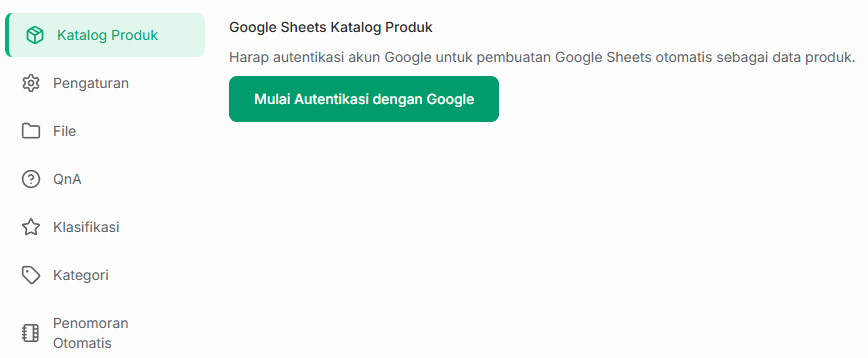
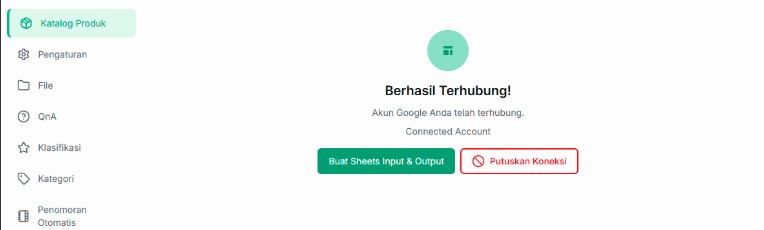
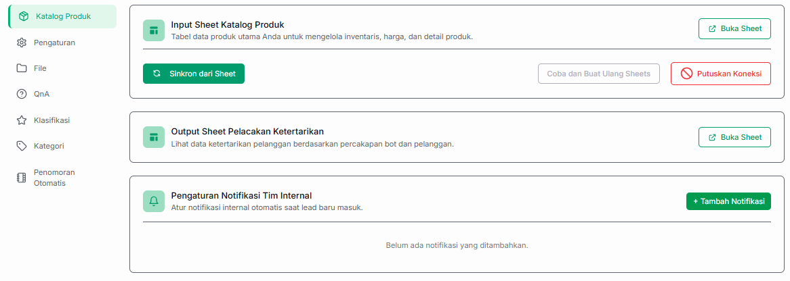
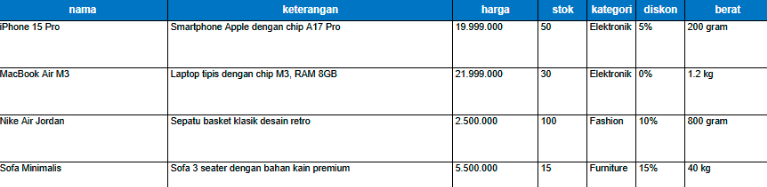
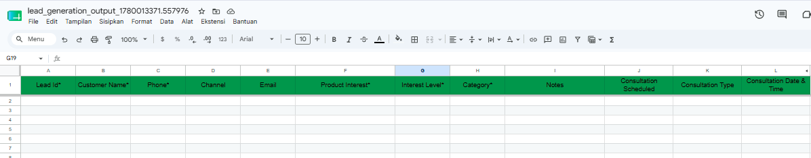
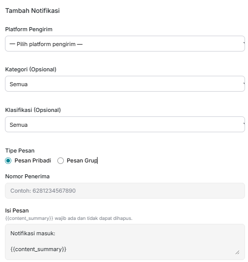
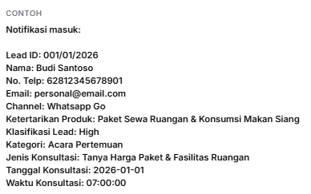

# 📦 Katalog Produk & Manajemen Prospek

Fitur **Katalog Produk** pada Bot Lead Generation memungkinkan AI Anda untuk mengenali barang atau jasa yang Anda jual. Seluruh basis data produk dan lead akan dihubungkan secara otomatis menggunakan Google Sheets agar mudah dikelola.

---

## 🔐 1. Autentikasi Akun Google

Langkah pertama yang wajib dilakukan adalah menautkan akun Google Anda ke dalam sistem Jangkau AI. Akun inilah yang nantinya akan digunakan untuk menyimpan file Google Drive (Sheets).

1. Klik tombol **Mulai Autentikasi dengan Google**.
2. Sebuah jendela baru akan terbuka. Pilih akun Google yang ingin Anda gunakan.
3. Berikan izin akses yang diminta agar sistem dapat membuat file otomatis di Google Drive Anda.

---

## 🔄 2. Membuat Sheets dan Mengelola Koneksi

Setelah akun berhasil terhubung, tampilan menu akan berubah menjadi seperti di bawah ini. Anda akan melihat status **Berhasil Terhubung!** beserta alamat email yang tertaut.

Pada tahap ini, Anda memiliki dua opsi tindakan utama:

*   **Buat Sheets Input & Output:** Klik tombol hijau untuk menginstruksikan sistem membuatkan file Google Sheets secara otomatis ke dalam Google Drive Anda.
*   **Putuskan Koneksi:** Klik tombol merah jika Anda ingin mengganti akun Google atau sudah tidak ingin menggunakan fitur integrasi Google Drive.

---

## 🛠️ 3. Pengaturan 3 Sektor Utama

Setelah Anda mengklik tombol "Buat Sheets Input & Output", sistem akan menampilkan tiga bagian seperti gambar berikut :

### A. Input Sheet (Katalog Produk)
Ini adalah database utama tempat AI mempelajari produk atau layanan bisnis Anda. Sistem telah menyediakan template *spreadsheet* yang bisa langsung Anda isi.

 **Aturan Kolom Input Sheet**

* **Kolom Wajib:** Anda wajib memiliki kolom **`nama`** dan **`keterangan`**. AI membutuhkan kedua kolom dasar ini untuk merekomendasikan produk ke pelanggan.
* **Kolom Tambahan:** Anda bebas menambahkan kolom lain (seperti *harga, stok, kategori, diskon, berat*, dll) menyesuaikan dengan kebutuhan bisnis Anda. AI akan secara otomatis membaca dan memahami **semua kolom** yang tersedia di sheet tersebut.

### B. Output Sheet (Pelacakan Ketertarikan)
Sheet ini merupakan data dari hasil kerja Bot AI Anda. Baris pada sheet ini **akan terisi secara otomatis** setiap kali ada (*lead*) baru yang masuk melalui percakapan interaksi pelanggan dengan Bot.

Sistem akan otomatis mencatat data ketertarikan pelanggan ke dalam kolom-kolom terstruktur seperti:

*   `Lead Id`, `Customer Name`, `Phone`, `Channel`, dan `Email`.
*   `Product Interest` (Produk yang diminati) dan `Interest Level` (Tingkat ketertarikan).
*   `Category` (Kategori leads) beserta `Notes` (Catatan percakapan).
*   Data janji temu otomatis jika pelanggan menjadwalkan konsultasi (`Consultation Scheduled`, `Consultation Type`, `Consultation Date & Time`).

---

### C. Pengaturan Notifikasi Tim Internal
Bagian ini digunakan apabila Anda ingin mengetahui **apakah ada lead baru yang masuk atau belum**. Setiap kali ada kriteria lead baru yang terpenuhi, sistem akan memicu alarm pemberitahuan otomatis ke tim internal Anda agar *follow-up* dapat dilakukan secepat mungkin.

Untuk mengaktifkan fitur ini, Anda perlu melengkapi komponen pengaturan berikut:

1.  **Platform Pengirim:** Pilih platform atau saluran komunikasi yang akan digunakan sistem untuk mengirimkan pesan notifikasi.
2.  **Kategori Leads:** Pilih jenis kategori prospek apa saja yang ingin Anda pantau untuk dikirimkan notifikasinya.
3.  **Klasifikasi:** Pilih tingkat klasifikasi leads tertentu (misalnya tingkat *High*) yang wajib memicu alarm masuk.
4.  **Tipe Pesan:** Tentukan arah tujuan pengiriman notifikasi, terdapat 2 pilihan:
    *   **Pribadi:** Jika memilih tipe ini, Anda wajib memasukkan nomor pribadi tujuan. Informasi data lead yang masuk nantinya hanya akan dikirimkan secara privat ke nomor telepon tersebut.
    *   **Grup:** Jika memilih tipe ini, informasi data lead yang masuk akan dikirimkan langsung ke dalam grup obrolan bersama, sehingga seluruh anggota tim di dalam grup tersebut dapat mengetahuinya secara transparan.
5.  **Isi Pesan:** Tulis template teks pesan notifikasi yang ingin Anda terima.

Berikut adalah contoh format tampilan ringkasan notifikasi yang akan diterima oleh tim internal Anda di ponsel mereka ketika ada lead baru yang berhasil didapatkan oleh AI:

