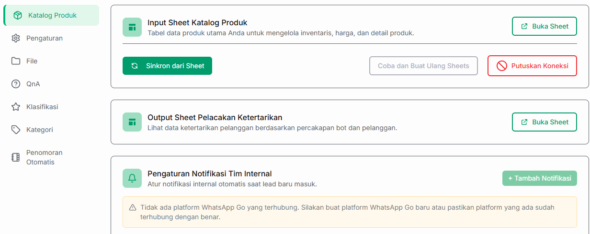

# 📦 Katalog Produk & Manajemen Prospek

Fitur **Katalog Produk** pada Bot Lead Generation memungkinkan AI Anda untuk mengenali barang atau jasa yang Anda jual. Seluruh basis data produk dan hasil prospek (lead) akan dihubungkan secara otomatis menggunakan Google Sheets agar mudah dikelola.

---

## 🔐 1. Autentikasi Akun Google

Langkah pertama yang wajib dilakukan adalah menautkan akun Google Anda ke dalam sistem Jangkau.ai. Akun inilah yang nantinya akan digunakan untuk menyimpan file Google Drive (Sheets).

1. Klik tombol **Mulai Autentikasi dengan Google**.
2. Sebuah jendela baru akan terbuka. Pilih akun Google yang ingin Anda gunakan.
3. Berikan izin akses yang diminta agar sistem dapat membuat file otomatis di Google Drive Anda.

---

## 🔄 2. Membuat Sheets dan Mengelola Koneksi

Setelah akun berhasil terhubung, tampilan menu akan berubah menjadi seperti di bawah ini. Anda akan melihat status **Berhasil Terhubung!** beserta alamat email yang tertaut.

Pada tahap ini, Anda memiliki dua opsi tindakan utama:

*   **Buat Sheets Input & Output:** Klik tombol hijau untuk menginstruksikan sistem membuatkan file Google Sheets secara otomatis ke dalam Google Drive Anda.
*   **Putuskan Koneksi:** Klik tombol merah jika Anda ingin mengganti akun Google atau sudah tidak ingin menggunakan fitur integrasi Google Drive.

---

## 🛠️ 3. Pengaturan 3 Sektor Utama

Setelah Anda mengklik tombol "Buat Sheets Input & Output", sistem akan menampilkan tiga bagian seperti gambar berikut :

### A. Input Sheet (Katalog Produk)
Ini adalah database utama tempat AI mempelajari produk atau layanan bisnis Anda. Sistem telah menyediakan template *spreadsheet* yang bisa langsung Anda isi.

!!! important "Aturan Kolom Input Sheet"
    * **Kolom Wajib:** Anda wajib memiliki kolom **`nama`** dan **`keterangan`**. AI membutuhkan kedua kolom dasar ini untuk merekomendasikan produk ke pelanggan.
    * **Kolom Tambahan:** Anda bebas menambahkan kolom lain (seperti *harga, stok, kategori, diskon, berat*, dll) menyesuaikan dengan kebutuhan bisnis Anda. AI akan secara otomatis membaca dan memahami **semua kolom** yang tersedia di sheet tersebut.

### B. Output Sheet (Pelacakan Ketertarikan)
Sheet ini merupakan muara dari hasil kerja Bot AI Anda. Seluruh data ketertarikan pelanggan, prospek potensial, maupun informasi kontak yang berhasil didapatkan oleh AI dari ruang obrolan akan dicatat secara rapi di dalam sheet ini.

### C. Pengaturan Notifikasi Tim Internal
Bagian ini memungkinkan Anda untuk memasang alarm otomatis. Setiap kali ada prospek (lead) baru yang berhasil dicatat oleh sistem, notifikasi akan langsung dikirimkan kepada tim internal Anda, sehingga *follow-up* bisa dilakukan dengan cepat.