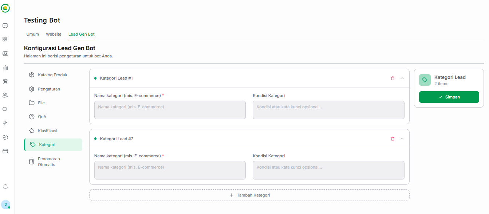

# 🏷️ Kategori Lead

Sama seperti fitur Klasifikasi, fitur **Kategori** pada Bot Lead Generation juga memiliki keterkaitan langsung dengan Output Sheet Anda. 

Bedanya, jika klasifikasi berfokus pada tingkat ketertarikan, fitur Kategori ini berfungsi untuk mengelompokkan lead berdasarkan jenis produk, topik, atau segmen pasar yang mereka tanyakan. Hasil dari pedoman pengaturan di menu ini akan secara otomatis diisi oleh AI ke dalam kolom **`Category`** pada file Google Sheets Output Anda.

---

## 🗂️ Cara Mengatur Kategori

Pada halaman konfigurasi Kategori, Anda dapat membuat beberapa kelompok kategori sesuai dengan lini bisnis Anda. Terdapat dua kolom isian utama yang perlu Anda lengkapi pada setiap blok Kategori Lead:

*   **Nama kategori (Wajib):** Tuliskan nama kelompok atau kategori utama dari prospek tersebut. Teks yang Anda ketikkan di sini (misalnya: *E-commerce, Pakaian Pria, Jasa Konsultasi*) adalah teks pasti yang akan dikirimkan oleh AI ke dalam kolom `Category` di Output Sheet.
*   **Kondisi Kategori:** Masukkan instruksi, kata kunci, atau kondisi opsional agar AI tahu kapan harus mengelompokkan pelanggan ke dalam kategori ini.
    *   *Contoh:* "Masukkan ke kategori ini jika pelanggan bertanya tentang layanan pembuatan website, toko online, atau menanyakan harga domain."

---

## ➕ Menambah & Menghapus Kategori

*   **Tambah Kategori:** Anda bebas mengelompokkan prospek ke dalam banyak kategori. Cukup klik tombol **+ Tambah Kategori** di bagian bawah kotak untuk memunculkan blok pengaturan kategori baru.
*   **Hapus Kategori:** Jika ada kategori yang sudah tidak digunakan atau salah input, Anda bisa menghapusnya dengan mengklik ikon **tempat sampah** berwarna merah di sudut kanan atas blok kategori yang bersangkutan.

---

## 💾 Menyimpan Pengaturan

Setelah Anda selesai menyusun semua kategori beserta kondisinya, jangan lupa untuk selalu mengklik tombol hijau **Simpan** yang berada di kotak sebelah kanan layar. Hal ini memastikan Bot AI segera menggunakan pedoman kategori terbaru Anda untuk mengkategorikan prospek.