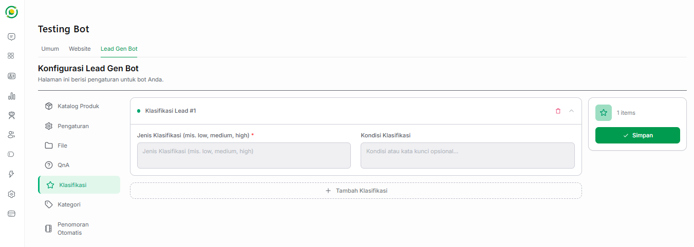

# ⭐ Klasifikasi Lead

Fitur **Klasifikasi** pada Bot Lead Generation berfungsi untuk menilai dan mengategorikan tingkat ketertarikan prospek (pelanggan) yang berinteraksi dengan bot Anda. 

Pengaturan pada menu ini **terhubung dan terintegrasi langsung dengan Output Sheet Anda.** Label klasifikasi yang diberikan oleh AI berdasarkan percakapan akan secara otomatis diisi ke dalam kolom **`Interest Level`** pada file Google Sheets tersebut.

---

## 🎛️ Cara Mengatur Klasifikasi

Pada halaman konfigurasi ini, Anda dapat merancang tolok ukur untuk menyaring potensial lead.

Terdapat dua kolom utama yang harus Anda lengkapi pada setiap blok Klasifikasi Lead:

*   **Jenis Klasifikasi (Wajib):** Tuliskan nama label atau tingkat ketertarikannya. Misalnya, Anda bisa mengisinya dengan *Low, Medium, High* atau *Cold, Warm, Hot*. Teks yang Anda masukkan di sini adalah teks pasti yang akan diinput oleh AI ke dalam kolom `Interest Level` di Output Sheet.
*   **Kondisi Klasifikasi:** Kolom ini berisi instruksi khusus, parameter, atau kata kunci untuk AI. Anda bisa menjabarkan kondisi seperti apa yang membuat prospek masuk ke dalam klasifikasi tersebut.
    *   *Contoh untuk label High:* "Pelanggan aktif bertanya tentang harga, ingin melakukan pemesanan, atau meninggalkan nomor telepon."
    *   *Contoh untuk label Low:* "Pelanggan hanya membalas singkat, menolak penawaran, atau tiba-tiba berhenti merespons (idle)."

---

## ➕ Mengelola Klasifikasi

*   **Tambah Parameter:** Anda bebas menentukan berapa banyak tingkatan klasifikasi yang digunakan oleh bisnis Anda. Klik tombol **+ Tambah Klasifikasi** yang terletak di bagian bawah kotak untuk menambahkan tingkatan baru.
*   **Menyimpan Data:** Setelah semua skenario klasifikasi selesai dibuat, pastikan Anda selalu mengklik tombol hijau **Simpan** di panel sebelah kanan agar AI segera memperbarui cara kerjanya.