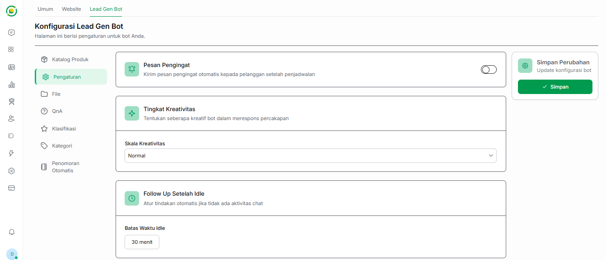

# ⚙️ Pengaturan Bot Lead Generation

Menu **Pengaturan** pada Bot Lead Generation memungkinkan Anda untuk mengonfigurasi otomatisasi tindak lanjut (*follow-up*) dan menyesuaikan gaya kecerdasan buatan (AI) saat merespons prospek Anda.

---

## 🔔 1. Pesan Pengingat (Reminder)

Fitur ini berfungsi untuk mengirimkan notifikasi otomatis kepada pelanggan. 
Jika diaktifkan (*toggle* menyala), Bot AI akan secara otomatis mengirimkan pesan pengingat kepada prospek atau pelanggan yang telah berhasil melakukan penjadwalan (janji temu) dengan bisnis Anda. Ini sangat berguna untuk mengurangi tingkat pembatalan atau ketidakhadiran (*no-show*).

---

## ✨ 2. Tingkat Kreativitas AI (Temperature)

Pengaturan ini mengontrol seberapa kaku atau luwes AI dalam merangkai kata saat membalas pesan dari pelanggan. Anda dapat memilih skala kreativitas dari menu *dropdown* yang tersedia:

* **Rendah Sekali / Rendah:** Bot akan menjawab dengan sangat faktual, kaku, dan konsisten. Sangat cocok jika Anda ingin bot hanya berpegang teguh pada katalog produk tanpa basa-basi.
* **Normal:** (Rekomendasi) Keseimbangan yang pas antara gaya bahasa yang natural namun tetap fokus pada tujuan mengumpulkan prospek.
* **Tinggi / Tinggi Sekali:** Bot akan lebih luwes, imajinatif, dan variatif dalam merespons kalimat pelanggan. Cocok untuk pendekatan yang sangat kasual atau bersahabat.

---

## ⏱️ 3. Follow Up Setelah Idle

Di dunia *sales*, pelanggan yang tiba-tiba berhenti membalas (*ghosting*) adalah hal yang biasa. Fitur ini dirancang untuk mengatasi masalah tersebut secara otomatis.

* **Fungsi:** Jika pelanggan tidak membalas pesan bot dalam kurun waktu tertentu, bot akan otomatis mengirimkan pesan *follow-up* (tindak lanjut) untuk memancing kembali interaksi pelanggan.
* **Batas Waktu Idle:** Anda bisa menentukan sendiri berapa lama bot harus menunggu sebelum mengirim pesan *follow-up* (misalnya: `30 menit`).

---
## 💾 Menyimpan Perubahan

Setelah Anda menyesuaikan konfigurasi di atas, jangan lupa untuk selalu mengklik tombol hijau **Simpan** di kotak **Simpan Perubahan** yang berada di sebelah kanan layar agar pengaturan baru Anda segera diterapkan pada Bot AI.