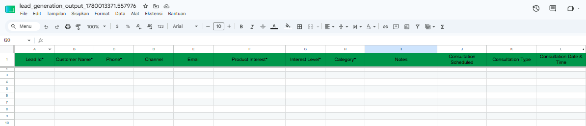
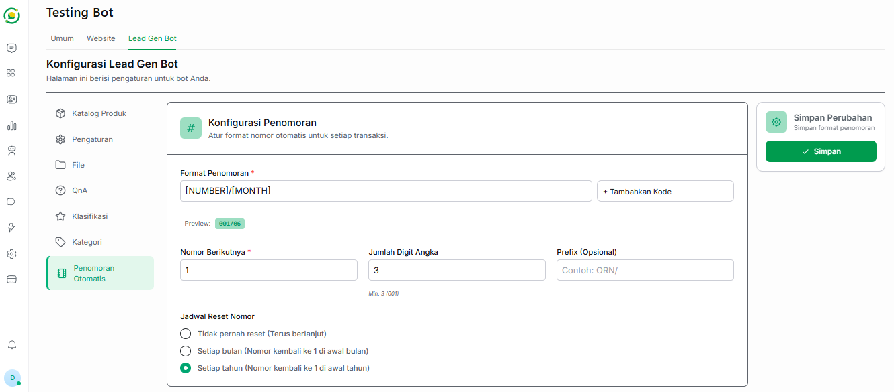

# 🔢 Penomoran Otomatis

Fitur **Penomoran Otomatis** pada Bot Lead Generation berfungsi untuk menciptakan kode unik atau ID transaksi bagi setiap prospek baru yang berhasil dicatat oleh bot. 

Pengaturan ini terhubung langsung dengan Output Sheet Anda. Hasil format penomoran yang Anda atur di sini akan secara otomatis diisi oleh AI ke dalam kolom **`Lead Id`** pada file Google Sheets Output.

---

## ⚙️ Cara Mengatur Format Penomoran

Pada halaman konfigurasi ini, Anda dapat mengatur sendiri bagaimana Lead ID yang Anda inginkan.

### 1. Format Penomoran Utama
Di bagian atas, terdapat kolom **Format Penomoran** yang bisa Anda isi dengan kombinasi kode. Anda tidak perlu mengetik kodenya secara manual, cukup manfaatkan menu *dropdown* yang tersedia:

*   Klik tombol **+ Tambahkan Kode** di sebelah kanan kolom.
*   Pilih variabel yang ingin dimasukkan, seperti **Nomor Urut**, **Bulan** (angka, romawi, singkatan, atau nama penuh), hingga **Tahun** (2 atau 4 digit).
*   Anda dapat melihat pratinjau (*preview*) dari format yang Anda buat tepat di bawah kolom isian tersebut.

### 2. Pengaturan Angka dan Prefix
Setelah format utama terbentuk, Anda perlu mengatur detail angkanya:

*   **Nomor Berikutnya:** Tentukan angka awal yang akan digunakan untuk Lead ID selanjutnya. Jika ini baru pertama kali dibuat, Anda bisa mengisinya dengan angka `1`.
*   **Jumlah Digit Angka:** Tentukan berapa panjang digit untuk nomor urut Anda. Minimal pengisian adalah 3 digit (contoh: `001`).
*   **Prefix (Opsional):** Jika Anda ingin menambahkan teks statis di depan ID, Anda bisa memasukkannya di sini (Contoh: `ORN/`).

### 3. Jadwal Reset Nomor
Untuk menjaga kerapian urutan data, Anda dapat mengatur kapan penomoran ini kembali ke angka awal (reset):

*   **Tidak pernah reset:** Nomor akan terus berlanjut tanpa batas.
*   **Setiap bulan:** Nomor urut akan kembali ke `1` pada setiap awal bulan baru.
*   **Setiap tahun:** Nomor urut akan kembali ke `1` pada setiap awal tahun baru.

---

## 💾 Menyimpan Perubahan

Setelah format penomoran sesuai dengan keinginan Anda, pastikan Anda mengklik tombol hijau **Simpan** pada kotak *Simpan Perubahan* di sebelah kanan layar. Mulai saat ini, setiap Lead ID baru di Output Sheet Anda akan mengikuti format tersebut.