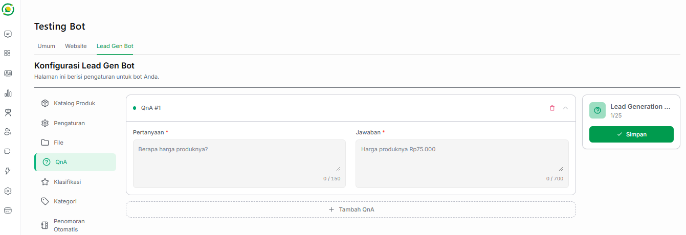

# ❓ QnA (Tanya Jawab & Basis Pengetahuan)

Fitur **QnA** berfungsi sebagai *Knowledge Base* (basis pengetahuan) tambahan bagi Bot AI Anda. Di sini, Anda bisa menyusun daftar pertanyaan yang paling sering diajukan oleh pelanggan (*Frequently Asked Questions*) beserta jawaban bakunya. 

Apabila di kemudian hari ada pelanggan yang menanyakan hal yang serupa atau sesuai dengan daftar FAQ ini, Bot AI akan secara otomatis menjawabnya menggunakan teks jawaban pasti yang sudah Anda tentukan di menu ini.

---

## 🧠 Cara Kerja & Pengaturan QnA

Sistem Jangkau.ai dirancang sangat fleksibel agar AI dapat mencocokkan maksud (*intent*) dari pertanyaan pelanggan meskipun gaya bahasanya sedikit berbeda dengan yang Anda ketikkan. 

Berikut adalah panduan mengisi kolom QnA:

*   **Pertanyaan (Wajib):** Tuliskan inti pertanyaan yang sering ditanyakan pelanggan. (Contoh: *"Berapa harga produknya?"*). Kolom ini memuat hingga maksimal **150 karakter**.
*   **Jawaban (Wajib):** Tuliskan jawaban informatif yang ingin Anda sampaikan secara langsung. (Contoh: *"Harga produknya Rp75.000"*). Kolom ini memuat hingga maksimal **700 karakter**.

---

## ➕ Mengelola Banyak Tanya Jawab

*   **Menambah QnA Baru:** Jika Anda memiliki lebih dari satu pertanyaan umum, klik tombol **+ Tambah QnA** di bagian bawah kotak input. Anda bisa menambahkan basis pengetahuan ini hingga maksimal **25 daftar QnA** (terlihat pada indikator kuota `1/25` di panel kanan).
*   **Menghapus QnA:** Jika ada informasi atau kebijakan harga yang berubah, Anda dapat menghapus baris QnA tersebut dengan mengklik ikon **tempat sampah** berwarna merah di pojok kanan atas setiap kotak.

---

## 💾 Menyimpan Perubahan

Setelah selesai memasukkan semua daftar pertanyaan dan jawaban penting bagi bisnis Anda, jangan lupa untuk mengklik tombol hijau **Simpan** pada panel *Lead Generation* di sebelah kanan. Langkah ini wajib dilakukan agar kecerdasan AI Anda langsung diperbarui dengan pengetahuan baru ini.