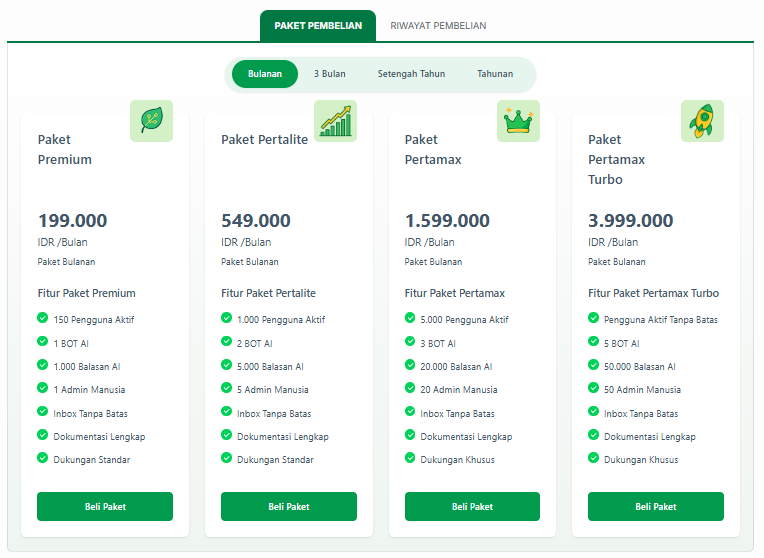
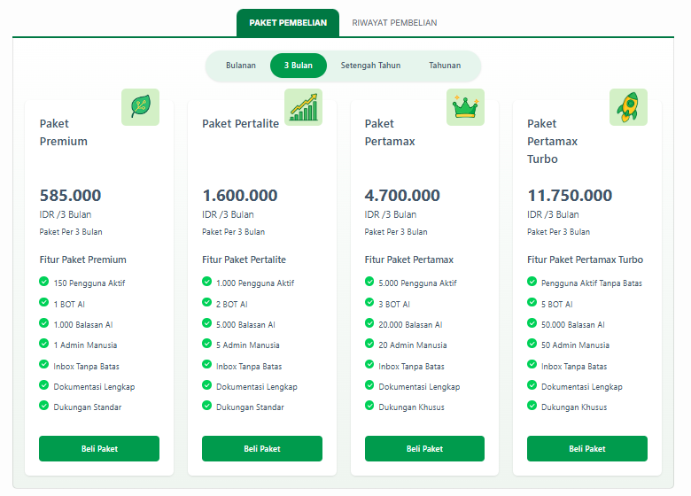
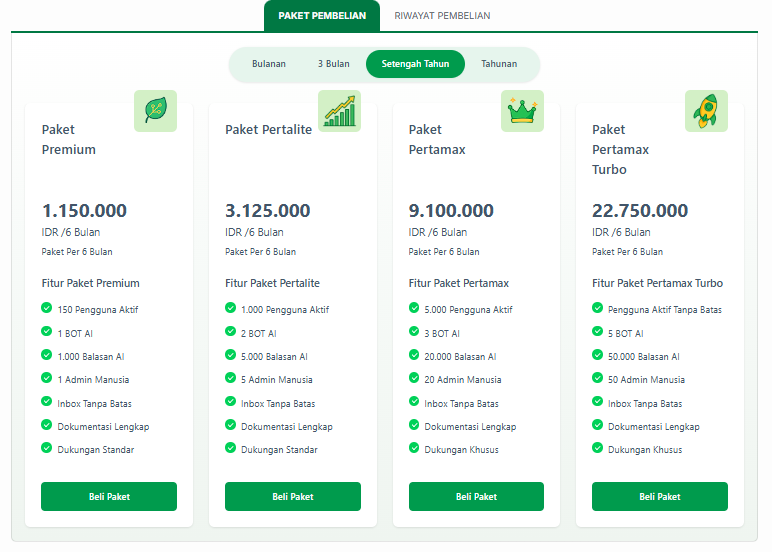
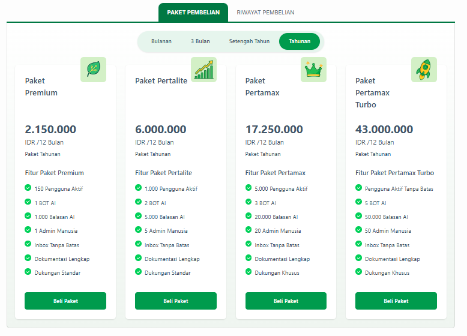

# 💳 Pilihan Paket & Pembayaran

Halaman **Pembayaran** menyediakan berbagai macam pilihan paket berlangganan Jangkau.ai yang fleksibel untuk mendukung operasional bisnis Anda. Tersedia **4 pilihan periode waktu** (Bulanan, 3 Bulan, Setengah Tahun, dan Tahunan) di mana masing-masing periode memiliki **4 tingkatan paket** yang dapat disesuaikan dengan skala kebutuhan interaksi pelanggan Anda.

---

## 📅 1. Paket Bulanan
Pilihan fleksibel bagi Anda yang ingin mencoba layanan atau menggunakannya dalam basis jangka pendek.

*   **Paket Premium:** Rp199.000 / Bulan
*   **Paket Pertalite:** Rp549.000 / Bulan
*   **Paket Pertamax:** Rp1.599.000 / Bulan
*   **Paket Pertamax Turbo:** Rp3.999.000 / Bulan

---

## 📅 2. Paket 3 Bulan
Pilihan paket kuartalan dengan harga yang lebih efisien dibanding memperbarui langganan setiap bulan.

*   **Paket Premium:** Rp585.000 / 3 Bulan
*   **Paket Pertalite:** Rp1.600.000 / 3 Bulan
*   **Paket Pertamax:** Rp4.700.000 / 3 Bulan
*   **Paket Pertamax Turbo:** Rp11.750.000 / 3 Bulan

---

## 📅 3. Paket Setengah Tahun (6 Bulan)
Paket semesteran untuk stabilitas dukungan pelanggan lini bisnis jangka menengah Anda.

*   **Paket Premium:** Rp1.150.000 / 6 Bulan
*   **Paket Pertalite:** Rp3.125.000 / 6 Bulan
*   **Paket Pertamax:** Rp9.100.000 / 6 Bulan
*   **Paket Pertamax Turbo:** Rp22.750.000 / 6 Bulan

---

## 📅 4. Paket Tahunan (12 Bulan)
Pilihan terbaik dan paling hemat untuk komitmen jangka panjang operasional otomasi bisnis Anda sepanjang tahun.

*   **Paket Premium:** Rp2.150.000 / 12 Bulan
*   **Paket Pertalite:** Rp6.000.000 / 12 Bulan
*   **Paket Pertamax:** Rp17.250.000 / 12 Bulan
*   **Paket Pertamax Turbo:** Rp43.000.000 / 12 Bulan

---

## 📊 Perbandingan Fitur Tiap Paket

Seluruh tingkatan paket di atas memiliki spesifikasi dan limitasi kuota operasional bawaan sebagai berikut:

| Fitur Utama | Paket Premium | Paket Pertalite | Paket Pertamax | Paket Pertamax Turbo |
| :--- | :---: | :---: | :---: | :---: |
| **Pengguna Aktif** | 150 Pengguna | 1.000 Pengguna | 5.000 Pengguna | **Tanpa Batas** |
| **Kuota BOT AI** | 1 Bot AI | 2 Bot AI | 3 Bot AI | 5 Bot AI |
| **Kuota Balasan AI** | 1.000 Balasan | 5.000 Balasan | 20.000 Balasan | 50.000 Balasan |
| **Admin Manusia** | 1 Admin | 5 Admin | 20 Admin | 50 Admin |
| **Kotak Masuk (Inbox)** | Tanpa Batas | Tanpa Batas | Tanpa Batas | Tanpa Batas |
| **Dokumentasi** | Lengkap | Lengkap | Lengkap | Lengkap |
| **Jenis Dukungan (Support)** | Standar | Standar | **Khusus** | **Khusus** |

---

## 🛍️ Cara Melakukan Pembayaran / Upgrade

1. Buka menu **Pembayaran** di bilah navigasi kiri paling bawah pada dasbor Jangkau.ai Anda.
2. Pilih tab periode waktu di bagian atas (*Bulanan / 3 Bulan / Setengah Tahun / Tahunan*).
3. Cari tingkatan paket (*Premium / Pertalite / Pertamax / Pertamax Turbo*) yang Anda inginkan.
4. Klik tombol **Beli Paket** di bagian bawah kolom paket tersebut.
5. Selesaikan proses transaksi pembayaran sesuai petunjuk metode pembayaran instruksional yang muncul pada layar dasbor Anda.