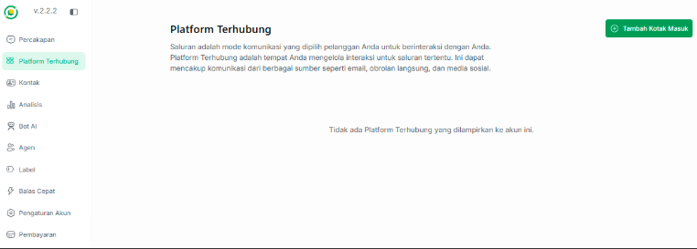
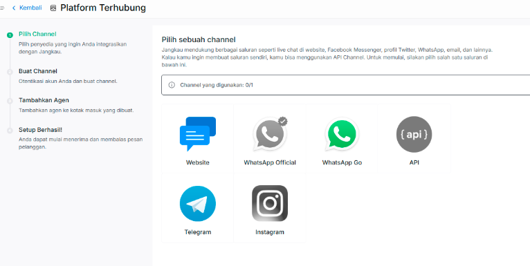
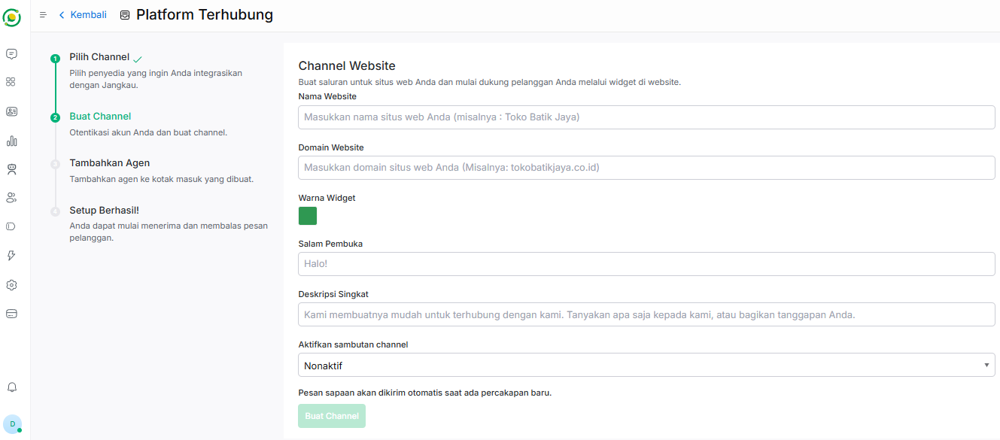
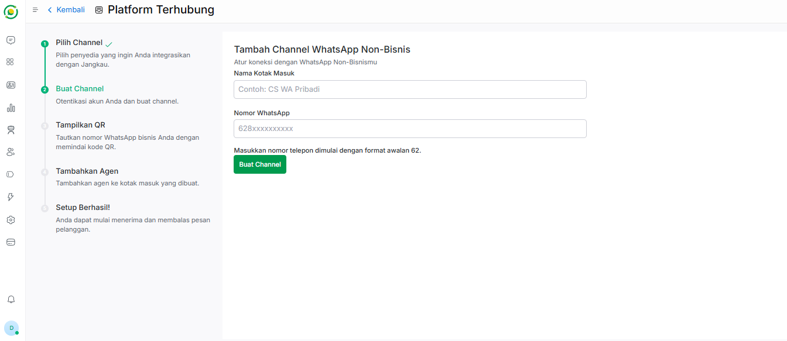
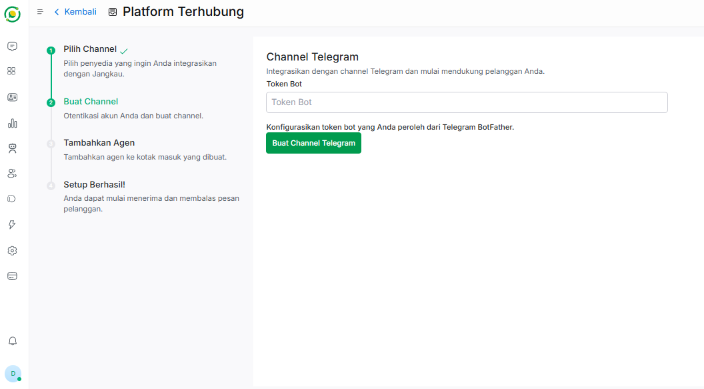

# 🔗 Platform Terhubung

Fitur **Platform Terhubung** adalah pusat integrasi di mana Anda dapat menghubungkan saluran komunikasi bisnis Anda ke dalam platform Jangkau AI. 

Dengan menghubungkan saluran ini, seluruh pesan dari pelanggan di berbagai aplikasi akan masuk ke dalam satu dasbor (*Omnichannel*), sehingga Bot AI atau Agen manusia dapat meresponsnya dengan mudah dan cepat.

---

## 📥 Langkah 1: Menambahkan Kotak Masuk (Inbox)

Untuk mulai menghubungkan saluran komunikasi baru:

1. Pada menu navigasi di sebelah kiri dasbor, klik **Platform Terhubung**.
2. Klik tombol hijau **+ Tambah Kotak Masuk** yang berada di sudut kanan atas halaman.

---

## 🔀 Langkah 2: Konfigurasi Saluran (Channel)

Setelah mengklik tombol tambah, Anda akan diarahkan ke halaman pemilihan penyedia layanan. Jangkau AI mendukung berbagai macam platform populer yang bisa disesuaikan dengan target pasar Anda.

Silakan pilih dan klik salah satu saluran yang ingin Anda integrasikan:

* **Website:** Pasang *widget live chat* langsung di situs web perusahaan Anda.

* **WhatsApp Official:** Hubungkan nomor WhatsApp Business API resmi (Meta).

* **WhatsApp Go:** Solusi koneksi WhatsApp alternatif.

* **API:** Buat saluran khusus menggunakan API (*Advanced*).

* **Telegram:** Hubungkan dengan bot Telegram bisnis Anda.

* **Instagram:** Hubungkan dengan Direct Message (DM) Instagram bisnis Anda.

Saat ini, Jangkau AI mendukung 3 saluran utama yang siap digunakan. Silakan pilih salah satu saluran dan ikuti panduan pengisian formulirnya di bawah ini:

### 🌐 A. Channel Website
Saluran ini digunakan jika Anda ingin memasang *widget live chat* langsung pada situs web perusahaan Anda.

**Komponen pengisian website:**

*   **Nama Website:** Masukkan nama identitas situs web Anda (Misalnya: *Toko Batik Jaya*).
*   **Domain Website:** Masukkan alamat URL atau domain resmi website Anda (Misalnya: *tokobatikjaya.co.id*).
*   **Warna Widget:** Atur warna tema tombol dan kotak obrolan agar senada dengan desain website Anda.
*   **Salam Pembuka:** Tulis kalimat sapaan awal yang muncul pada teks utama widget (Contoh: *Halo!*).
*   **Deskripsi Singkat:** Penjelasan pendek di bawah salam pembuka untuk memancing interaksi pelanggan.
*   **Aktifkan Sambutan Channel:** Anda dapat memilih opsi **Aktif** atau **Nonaktif**. Jika diaktifkan, Anda bisa membuat pesan kustom tambahan yang akan dikirim secara otomatis oleh sistem saat ada percakapan baru masuk.

**Langkah Akhir:** Klik tombol **Buat Channel**. Setelah saluran berhasil dibuat, Anda akan diarahkan untuk memasukkan atau menugaskan **Agen** yang sebelumnya telah Anda daftarkan di sistem.

---

### 💬 B. Channel WhatsApp
Saluran ini digunakan untuk menghubungkan nomor WhatsApp ke sistem dasbor Jangkau AI

**Komponen pengisian whatsapp:**

*   **Nama Kotak Masuk:** Masukkan nama penanda untuk membedakan kotak masuk ini (Contoh: *CS WA Pribadi*).
*   **Nomor WhatsApp:** Masukkan nomor telepon WhatsApp yang ingin dihubungkan, pastikan dimulai dengan format awalan **62**.

**Langkah Akhir:** Klik tombol **Buat Channel**. Setelah itu, sistem akan memunculkan sebuah **QR Code** di layar. Buka aplikasi WhatsApp di ponsel Anda, pilih *Perangkat Tertaut*, lalu lakukan scan QR Code tersebut. Jika sudah terhubung, langkah terakhir adalah memasukkan **Agen** yang sesuai untuk mengelola obrolan dari nomor ini.

---

### ✈️ C. Channel Telegram
Saluran ini digunakan untuk menghubungkan robot obrolan (Bot) Telegram bisnis Anda ke dalam sistem.

**Komponen pengisian telegram:**

*   **Token Bot:** Masukkan kode token rahasia resmi yang Anda peroleh dari **Telegram BotFather** saat pertama kali membuat bot di Telegram.

**Langkah Akhir:** Klik tombol **Buat Channel Telegram**. Setelah token berhasil divalidasi dan tersambung oleh sistem, Anda tinggal memasukkan **Agen** yang bertanggung jawab penuh atas masuknya pesan-pesan dari Telegram tersebut.