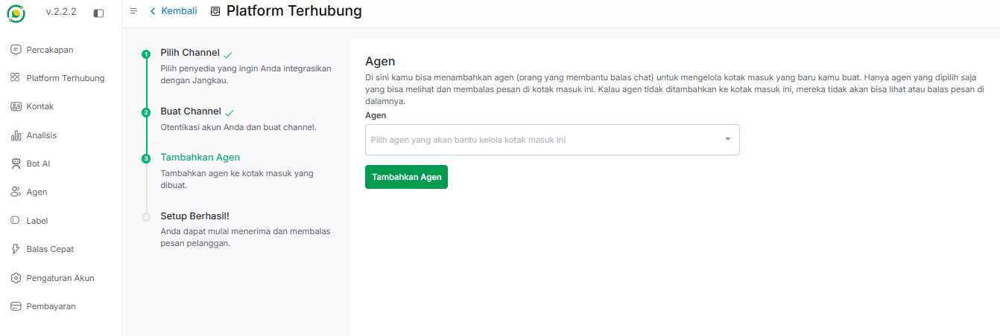
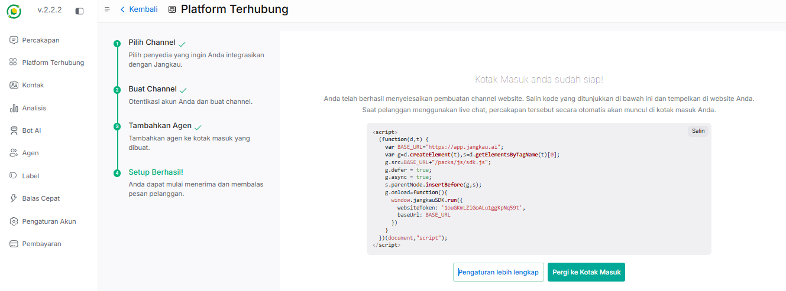
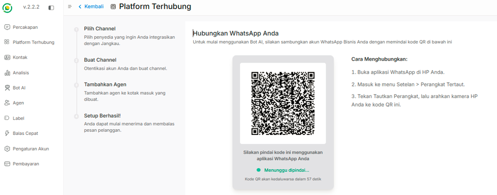
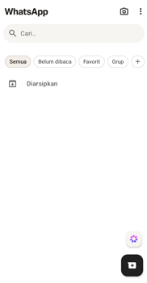
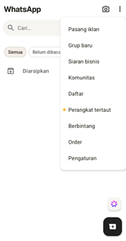
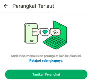
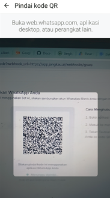

# 🔗 Platform Terhubung

Fitur **Platform Terhubung** adalah pusat integrasi di mana Anda dapat menghubungkan saluran komunikasi bisnis Anda ke dalam platform Jangkau AI. 

Dengan menghubungkan saluran ini, seluruh pesan dari pelanggan di berbagai aplikasi akan masuk ke dalam satu dasbor (*Omnichannel*), sehingga Bot AI atau Agen manusia dapat meresponsnya dengan mudah dan cepat.

---

## 📥 Langkah 1: Menambahkan Kotak Masuk (Inbox)

Untuk mulai menghubungkan saluran komunikasi baru:

1. Pada menu navigasi di sebelah kiri dasbor, klik **Platform Terhubung**.
2. Klik tombol hijau **+ Tambah Kotak Masuk** yang berada di sudut kanan atas halaman.

---

## 🔀 Langkah 2: Konfigurasi Saluran (Channel)

Setelah mengklik tombol tambah, Anda akan diarahkan ke halaman pemilihan penyedia layanan. Jangkau AI mendukung berbagai macam platform populer yang bisa disesuaikan dengan target pasar Anda.

Silakan pilih dan klik salah satu saluran yang ingin Anda integrasikan:

* **Website:** Pasang *widget live chat* langsung di situs web perusahaan Anda.

* **WhatsApp Official:** Hubungkan nomor WhatsApp Business API resmi (Meta).

* **WhatsApp Go:** Solusi koneksi WhatsApp alternatif.

* **API:** Buat saluran khusus menggunakan API (*Advanced*).

* **Telegram:** Hubungkan dengan bot Telegram bisnis Anda.

* **Instagram:** Hubungkan dengan Direct Message (DM) Instagram bisnis Anda.

Saat ini, Jangkau AI mendukung 3 saluran utama yang siap digunakan. Silakan pilih salah satu saluran dan ikuti panduan pengisian formulirnya di bawah ini:

### 🌐 A. Channel Website
Saluran ini digunakan jika Anda ingin memasang *widget live chat* langsung pada situs web perusahaan Anda. Proses integrasi terbagi menjadi 3 tahapan utama:

#### **Tahap 1: Buat Channel Website**
Isi formulir konfigurasi awal untuk menyesuaikan tampilan widget pada website Anda.

**Komponen pengisian website:**

*   **Nama Website:** Masukkan nama identitas situs web Anda (Misalnya: *Toko Batik Jaya*).
*   **Domain Website:** Masukkan alamat URL atau domain resmi website Anda (Misalnya: *tokobatikjaya.co.id*).
*   **Warna Widget:** Atur warna tema tombol dan kotak obrolan agar senada dengan desain website Anda.
*   **Salam Pembuka:** Tulis kalimat sapaan awal yang muncul pada teks utama widget (Contoh: *Halo!*).
*   **Deskripsi Singkat:** Penjelasan pendek di bawah salam pembuka untuk memancing interaksi pelanggan.
*   **Aktifkan Sambutan Channel:** Anda dapat memilih opsi **Aktif** atau **Nonaktif**. Jika diaktifkan, Anda bisa membuat pesan kustom tambahan yang akan dikirim secara otomatis oleh sistem saat ada percakapan baru masuk.

Setelah semua kolom diisi, klik tombol **Buat Channel** untuk melanjutkan ke tahap berikutnya.

---

#### **Tahap 2: Tambahkan Agen**
Di sini Anda bisa menambahkan agen (orang yang membantu balas chat) untuk mengelola kotak masuk yang baru Anda buat. 

 

> ⚠️ **Penting:** Hanya agen yang dipilih yang bisa melihat dan membalas pesan di kotak masuk ini.

1. Klik kolom pilihan **Agen**.
2. Pilih nama agen yang akan ditugaskan untuk mengelola kotak masuk website ini.
3. Klik tombol hijau **Tambahkan Agen**.

---

#### **Tahap 3: Setup Berhasil & Salin Script**
Kotak masuk Anda sudah siap! Anda telah berhasil menyelesaikan pembuatan channel website. Langkah terakhir adalah memasang script integrasi ke dalam kode situs web Anda.

 

1. Salin kode JavaScript yang muncul di layar dengan mengklik tombol **Salin** di sudut kanan atas kotak kode.
2. Tempel (*paste*) kode tersebut di dalam struktur HTML website Anda 

---

### 💬 B. Channel WhatsApp
Saluran ini digunakan untuk menghubungkan nomor WhatsApp ke sistem dasbor Jangkau AI. Proses integrasi terbagi menjadi 3 tahapan utama:

#### **Tahap 1: Buat Channel WhatsApp**
Isi informasi dasar untuk mengidentifikasi kotak masuk nomor WhatsApp bisnis Anda.

**Komponen pengisian whatsapp:**

*   **Nama Kotak Masuk:** Masukkan nama penanda untuk membedakan kotak masuk ini (Contoh: *CS WA Pribadi*).
*   **Nomor WhatsApp:** Masukkan nomor telepon WhatsApp yang ingin dihubungkan, pastikan dimulai dengan format awalan **62** (Contoh: *628123456789*).

Setelah mengisi kedua kolom tersebut, klik tombol **Buat Channel**.

---

#### **Tahap 2: Pindai (Scan) QR Code dari HP**
Setelah mengeklik tombol buat channel, layar dasbor Jangkau AI akan memunculkan sebuah halaman integrasi yang berisi **QR Code** tautan aktif.

Silakan siapkan handphone yang terpasang nomor WhatsApp tersebut, lalu ikuti tutorial pemindaian berikut ini:

1. **Buka Aplikasi WhatsApp:** Pada halaman utama chat aplikasi WhatsApp Anda, ketuk **ikon titik tiga (︙)** yang berada di sudut kanan atas layar.
   
   

2. **Pilih Perangkat Tertaut:** Pada menu pilihan (*dropdown*) yang muncul, pilih opsi **Perangkat tertaut**.
   
   

3. **Tautkan Perangkat:** Di dalam menu Perangkat Tertaut, ketuk tombol hijau besar bertuliskan **Tautkan Perangkat**. Jika HP Anda menggunakan sistem keamanan sandi, pola, atau sidik jari, silakan lakukan verifikasi terlebih dahulu.
   
   

4. **Pindai QR Code:** Kamera pemindai di HP Anda akan otomatis terbuka. Arahkan kamera HP Anda tepat ke arah **QR Code** yang tampil di layar komputer atau dasbor Jangkau AI Anda. Tunggu beberapa saat hingga proses sinkronisasi selesai dan nomor Anda terdaftar.
   
   

---

#### **Tahap 3: Tambahkan Agen**
Setelah nomor WhatsApp sukses terhubung dan tersinkronisasi oleh sistem, langkah terakhir adalah menentukan tim yang bertanggung jawab mengelola pesan masuk.

> ⚠️ **Penting:** Hanya agen yang dipilih yang bisa melihat dan membalas pesan di kotak masuk ini.

1. Klik pada kolom pilihan **Agen**.
2. Pilih satu atau beberapa nama agen yang akan ditugaskan mengelola nomor WhatsApp ini.
3. Klik tombol hijau **Tambahkan Agen** untuk menyelesaikan proses setup.

Setelah agen ditambahkan, seluruh chat masuk ke nomor WhatsApp tersebut akan langsung dialirkan ke dalam dasbor *Omnichannel* Jangkau AI Anda.

---

### ✈️ C. Channel Telegram
Saluran ini digunakan untuk menghubungkan robot obrolan (Bot) Telegram bisnis Anda ke dalam sistem.

**Komponen pengisian telegram:**

*   **Token Bot:** Masukkan kode token rahasia resmi yang Anda peroleh dari **Telegram BotFather** saat pertama kali membuat bot di Telegram.

**Langkah Akhir:** Klik tombol **Buat Channel Telegram**. Setelah token berhasil divalidasi dan tersambung oleh sistem, Anda tinggal memasukkan **Agen** yang bertanggung jawab penuh atas masuknya pesan-pesan dari Telegram tersebut.