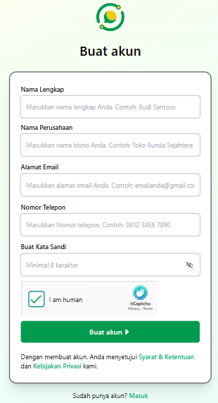
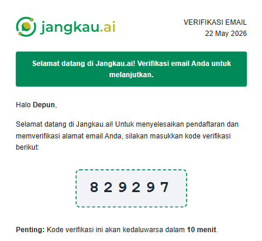
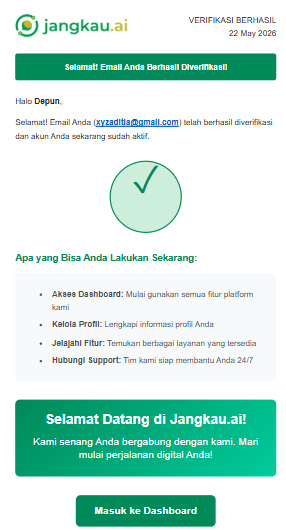

# 🔑 Cara Registrasi Akun Baru

Selamat datang di Jangkau AI ! Untuk mulai menggunakan layanan AI Agen kami, langkah pertama yang wajib dilakukan adalah mendaftarkan bisnis Anda dan membuat akun baru.

Ikuti panduan langkah demi langkah di bawah ini:

### Langkah 1: Kunjungi Halaman Registrasi
Buka browser Anda dan akses halaman registrasi resmi Jangkau.ai melalui tautan berikut: 

👉 **[https://app.jangkau.ai/app/auth/signup](https://app.jangkau.ai/app/auth/signup)**

Setelah halaman terbuka, Anda akan melihat formulir pendaftaran akun seperti gambar di bawah ini.

---

### Langkah 2: Isi Informasi Registrasi 
Masukkan Informasi berikut

* **Nama Lengkap** 
* **Nama Perusahaan** 
* **Alamat Email** 
* **Nomor Telepon**
  
---

### Langkah 3: Buat Kata Sandi
Kata sandi memiliki **minimal 8 karakter** dengan kombinasi berikut:

* Minimal terdapat **1 huruf kapital** 
* Minimal terdapat **1 huruf kecil**
* Minimal terdapat **1 karakter khusus** 

---

### Langkah 4: Verifikasi Akun

* Lakukan Captcha dengan melakukan centang kotak **"I am human** untuk melakukan verifikasi
* Klik tombol hijau bertuliskan **Buat akun**.
* Nanti akan terdapat email verifikasi seperti gambar berikut :

* Masukkan kode verifikasi dan nanti akan mendapat email akun telah terverifikasi seperti berikut :

* Klik masuk dashboard atau bisa login di link berikut **[https://app.jangkau.ai/app/login](https://app.jangkau.ai/app/login)**
  
🎉 **Selamat!** Akun Jangkau AI Anda kini sudah aktif dan siap digunakan.