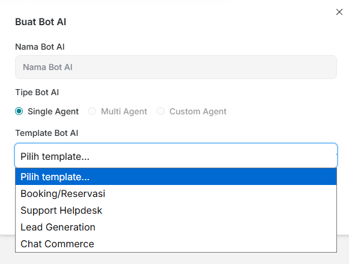
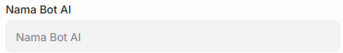
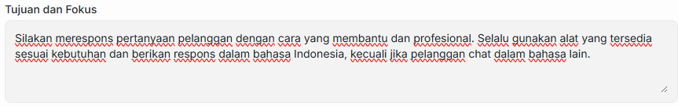
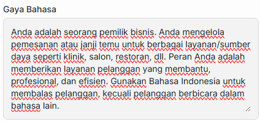
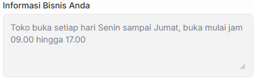
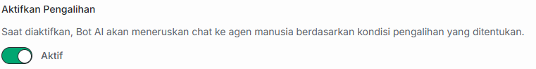
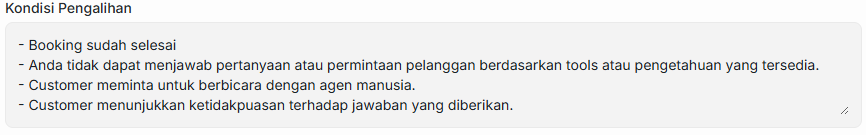
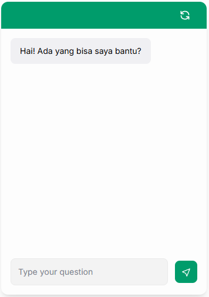
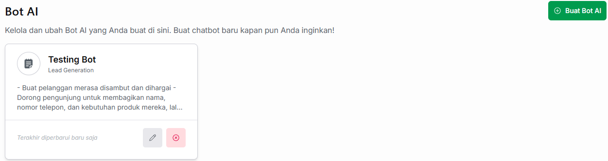

# ⚙️ Pengaturan Umum Bot AI

Halaman ini menjelaskan panduan dasar pembuatan dan pengaturan awal yang berlaku secara umum untuk seluruh tipe Bot AI di platform Jangkau AI

---

## 🚀 Tahap Awal: Membuat Bot AI Baru

Untuk memulai pembuatan Bot AI, ikuti langkah berikut:

1. Masuk ke dashboard Jangkau AI lalu klik tombol **Bot AI** pada panel di sebelah kiri.
2. Klik **+ Buat Bot AI**
3. Masukkan **Nama Bot AI** sesuai preferensi Anda.
4. Pada pilihan **Tipe Bot AI**, pilih **Single Agent**.
5. Pada pilihan **Template Bot AI**. Terdapat 4 jenis bot yang bisa anda pilih sesuai dengan kebutuhan anda :
      * Booking/Reservasi
      * Support Helpdesk
      * Lead Generation
      * Chat Commerce 

---

## 📝 Komponen Pengaturan Utama

Setelah bot berhasil dibuat, Anda akan diarahkan ke halaman konfigurasi dasar. Berikut adalah bagian-bagian penting yang wajib Anda isi:

### 1. Nama Bot AI
Kolom identitas digital untuk bot Anda. Nama ini bebas ditentukan dan dapat disesuaikan dengan kebutuhan internal perusahaan.

### 2. Tujuan dan Fokus 
Bagian ini adalah bagian prompting utama dan inti dari Bot AI Anda. Tuliskan instruksi mendetail mengenai tugas utama, apa yang harus dilakukan, dan apa  yang harus dicapai oleh bot tersebut. 

Berikut adalah contoh **Tujuan dan Fokus** ketika anda membuka menu umum :

### 3. Gaya Bahasa
Gaya bahasa akan menentukan kepribadian dan cara berkomunikasi Bot AI saat berinteraksi dengan pelanggan. 

Berikut adalah contoh **Gaya Bahasa** ketika anda membuka menu umum :

### 4. Informasi Bisnis Anda
Berikan basis pengetahuan kontekstual mengenai operasional bisnis Anda agar AI tidak memberikan jawaban yang keliru.

Berikut adalah contoh **Informasi Bisnis** ketika anda membuka menu umum :

---

## 🔀 Fitur Aktifkan Pengalihan (Agen Handover)

Fitur ini berfungsi sebagai pembatas antara Bot AI dan agen. Saat diaktifkan, Bot AI akan meneruskan *room chat* ke agen manusia secara otomatis berdasarkan kondisi-kondisi darurat tertentu yang telah ditentukan.

### ⚠️ Kondisi Pengalihan 
Kondisi Pengalihan hanya akan muncul jika Anda mengaktifkan **Pengalihan**. Bot AI akan otomatis berhenti menjawab dan memanggil Tim CS/Agen manusia jika mendeteksi situasi-situasi yang sudah di setting berikut:

---

## 🧪 Simulator Uji Coba Bot

Di sebelah kanan menu umum, terdapat *widget* simulator obrolan langsung. 

Setiap kali Anda selesai mengubah pengaturan di atas atau memperbarui basis data informasi bisnis, Anda dapat langsung melakukan tes percakapan di box ini untuk memastikan respon AI sudah sesuai sebelum disebarkan ke website asli.

Setelah semua pengaturan Bot AI sesuai dengan keinginan Anda, klik Simpan dan Bot AI siap digunakan

